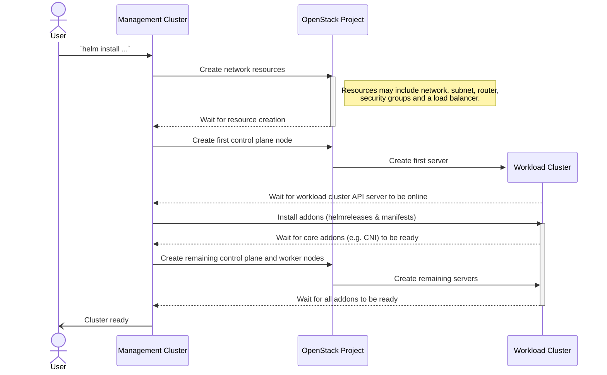

# Debugging

## Cluster Creation Summary

The following diagram represents a high-level summary of cluster creation process. Each stage is described in more detail below.



## Provisioning Stages

This page describes the various milestones that occur between the initial creation of an openstack-cluster [Helm release](https://helm.sh/docs/glossary/#release) and a fully functional cluster which is ready for use. At each step in the list below, some commonly encountered issues are highlighted; however, this should not be treated as an exhaustive list and further investigation may be required on a case by case basis.

> [!IMPORTANT]
> In all of the code snippets below, any commands which are targeting the Cluster API management cluster will be denoted with `--kubeconfig capi-mgmt` whereas those targetting the workload cluster will use `--kubeconfig workload`.

When an openstack-cluster Helm release is created, the provided Helm values are used to generate a set of Kubernetes yaml resources which are then applied to the cluster. The generated resources can be viewed using the Helm CLI:

```
helm --kubeconfig capi-mgmt get manifest <release-name>
```

To instead generate a more concise list of the resource types, use something like

```
helm --kubeconfig capi-mgmt get manifest <release-name> | grep ^kind: | uniq -c
```

which will generate output similar to

```
    1 kind: ServiceAccount
   12 kind: Secret
    1 kind: Role
    1 kind: RoleBinding
    1 kind: Deployment
    1 kind: Cluster
   12 kind: HelmRelease
    1 kind: KubeadmConfigTemplate
    1 kind: KubeadmControlPlane
    1 kind: MachineDeployment
    2 kind: MachineHealthCheck
    8 kind: Manifests
    1 kind: OpenStackCluster
    2 kind: OpenStackMachineTemplate
```

The two key top-level resources in the above list are the `Cluster` and `OpenStackCluster` resources. The creation of the `OpenStackCluster` resource is the cue for the [Cluster API provider OpenStack](https://github.com/kubernetes-sigs/cluster-api-provider-openstack) (CAPO) to begin interacting with the OpenStack APIs for the target cloud.

### OpenStack Networking components

After performing some initial validation on the provided configuration, the `capo-controller-manager` pod will create various OpenStack resources. Depending on the provided Helm values, the created resources may include an OpenStack tenant network and subnet, a Neutron router connecting the tenant network to the configured external network, and an Octavia load balancer for the workload cluster's Kubernetes API server. The creation of these resources (and any errors encountered) will be logged in the `capo-controller-manager` pod, the logs for which can be inspected using

```
kubectl --kubeconfig capi-mgmt logs -n capo-system deployment/capo-controller-manager
```

and should show messages such as

```
I0730 14:27:45.708588  1 openstackcluster_controller.go:432] "Reconciling network components" controller="openstackcluster" controllerGroup="infrastructure.cluster.x-k8s.io" controllerKind="OpenStackCluster" OpenStackCluster="<namespace>/<cluster>" namespace="<namespace>" name="<cluster>" reconcileID="<id>" cluster="<cluster>"
```

The progress of these steps can also be monitored using the OpenStack Horizon dashboard or the `openstack` CLI.

Commonly encountered issues at this stage (usually visible in the CAPO controller logs) include:

- Incorrectly formatted cloud credentials (see [these docs](https://github.com/azimuth-cloud/capi-helm-charts/blob/main/charts/openstack-cluster/README.md#openstack-credentials))

- Insufficient quota in the target OpenStack project (for various resources such as networks, subnets, security groups etc.)

- Incorrect network names, IDs or other filters (e.g. if both an ID and a name are provided simultaneously in network filter config then CAPO might do [unexpected things](https://github.com/kubernetes-sigs/cluster-api-provider-openstack/blob/6560f8882a2aa7ece3d13d47f2f2badbcba348c3/api/v1beta1/types.go#L160))

### First control plane node

After creating any necessary networking resources, the CAPO controller will create the first control plane node. Once the node has initialised successfully, the output of the `kubeadm init` command should be visible in the server logs (visible e.g. in the OpenStack Horizon dashboard):

```
 Your Kubernetes control-plane has initialized successfully!

 To start using your cluster, you need to run the following as a regular user:

   mkdir -p $HOME/.kube
   sudo cp -i /etc/kubernetes/admin.conf $HOME/.kube/config
   sudo chown $(id -u):$(id -g) $HOME/.kube/config

 Alternatively, if you are the root user, you can run:

   export KUBECONFIG=/etc/kubernetes/admin.conf

 You should now deploy a pod network to the cluster.
.yaml" with one of the options listed at:
   https://kubernetes.io/docs/concepts/cluster-administration/addons/

 You can now join any number of control-plane nodes by copying certificate authorities
 and service account keys on each node and then running the following as root:

   kubeadm join <ip-address>:6443 --token <join-token> \
 	--discovery-token-ca-cert-hash <hash> \
 	--control-plane
```

> [!NOTE]
> No manual kubeadm commands are required as the remaining cluster nodes will join the cluster automatically. The above output is just the standard help text output from `kubeadm`.

Commonly encountered issues (usually visible in the CAPO controller logs) include:

- Insufficient quota in the target OpenStack project (for servers, volumes etc.)

- Network routing issues between the CAPI management cluster and the workload cluster

### Essential Addons

Now that the first control plane node has initialised successfully, the kubeconfig for the workload cluster will be written to a Kubernetes `Secret` named `<cluster-name>-kubeconfig` on the CAPI management cluster. At this point, the kubeconfig can be extracted from the secret for use with `kubectl` using the following command:

```
kubectl --kubeconfig capi-mgmt get secret <cluster-name>-kubeconfig -o jsonpath='{.data.value}' > workload
```

The workload cluster API server can be queried using this kubeconfig, for example, by running

```
kubectl --kubeconfig workload get nodes
```

which should show at least 1 cluster node.

The [cluster-api-addon-provider](https://github.com/azimuth-cloud/cluster-api-addon-provider) will now begin to install the cluster addons. The progress of these addon installations can be monitored with

```
kubectl --kubeconfig capi-mgmt get helmreleases,manifests -A
```

where each `helmrelease` resource on the management cluster represents a real Helm release that will be installed on the workload cluster. Similarly, each `manifest` resource represents a set of ad-hoc Kubernetes manifests which will be installed on the workload cluster.

Any errors during the installation of the addons onto the workload cluster will be written to the logs of the `cluster-api-addon-provider` pod.

If the addons stall during installation for an extended period of time (e.g. 10 minutes or more) then it may also be worth checking for any pods on the workload cluster which are not in a `Running` state and investigating the root cause of the issues with any problematic pods.

Issues discovered on some clouds at this stage include:

- Insufficient volume quota in the target OpenStack project (some addons required separate Cinder volumes). These kind of errors will be surfaced in the logs for the various pods in the `openstack-system` namespace on the workload cluster.

- Network IP range clashes. For example, the [workload cluster's internal network config](https://github.com/azimuth-cloud/capi-helm-charts/blob/37ab14468c5b6abeec75aa12e5328bb6468e84c8/charts/openstack-cluster/values.yaml#L34-L45) may clashes with other important IP addresses such as the CIDR for the OpenStack subnet on which the cluster was provisioned or some cloud-specific on-site DNS servers.

### Remaining Nodes and Addons

Once the essential addons required for a functional cluster (e.g. a [CNI](https://github.com/azimuth-cloud/capi-helm-charts/tree/main/charts/cluster-addons#container-network-interface-cni-plugins)) have been installed, the remaining control plane and worker nodes for the cluster will be provisioned and the addon installation process will proceed untill all workload cluster addons are installed.

Any errors while provisioning the remaining cluster nodes will appear in the `capo-controller-manager` pod logs on the management cluster.

Any errors while installing the cluster addons will likely appear either in the `cluster-api-addon-provider` pod logs on the management cluster, in the output of `helm --kubeconfig workload list -aA` on the workload cluster, or in any of the logs or events for pods in an unready state on the workload cluster.
